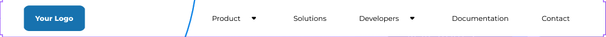
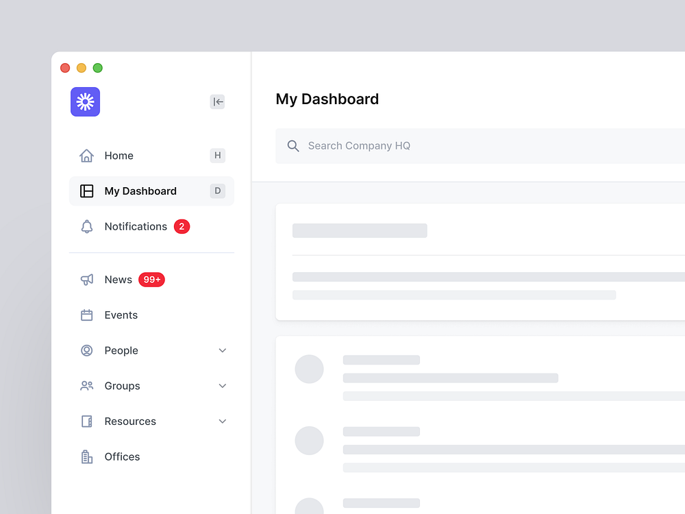

# CssComponents

### Objective

- This repository will intend to contain all the Css modules and components that I will create to practice frontend

## Content 

### Task Mozilla 

- Contains the practice tasks from the mozilla CDN website to learn and practice CSS [Mozilla](https://developer.mozilla.org/en-US/docs/Learn/CSS/Building_blocks/Selectors/Selectors_Tasks)

- CoolLoookingBox - [Cool Looking Box](https://developer.mozilla.org/en-US/docs/Learn/CSS/Building_blocks/A_cool_looking_box)

- Fancy LetterHead Paper - [Fancy Letterhead paper](https://developer.mozilla.org/en-US/docs/Learn/CSS/Building_blocks/Creating_fancy_letterheaded_paper)

- Fundamental Layout comprehension - [Fundamental Layout Comprehension](https://developer.mozilla.org/en-US/docs/Learn/CSS/CSS_layout/Fundamental_Layout_Comprehension)

- Navigation Bar Layout - 

- Website Design with Navbar - 

